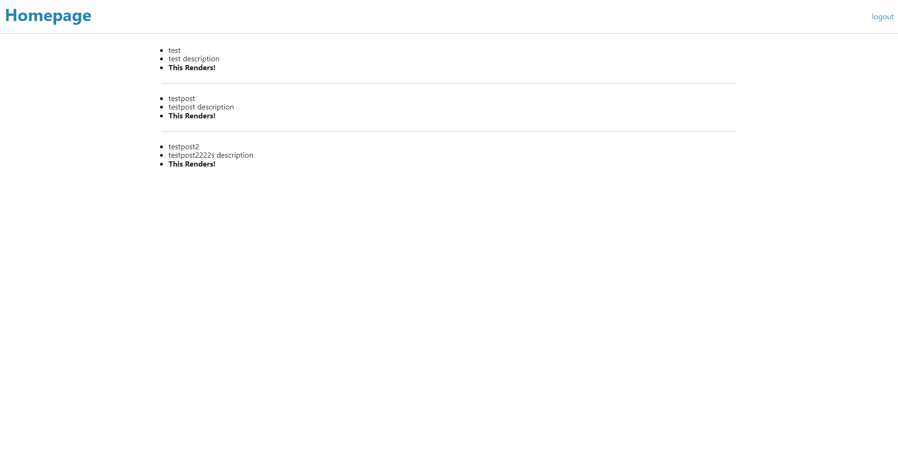

# 14-Tech-blog

  

    

  ## Description
  This project was assigned during the Georgia Tech Full Stack Flex Development Program. The aim of this project was to combine our new backend development knowledge with our previous front end knowledge to create our first full stack app. I tried my absolute best with this app. I was even able to get what I would call the main function of the app completed. However, I fail to understand how I can connect the user that created the post to that post, and further to how to render that with each individual post using handlebars.
   

  )

  
  ## Table of Contents
  1. [Description](#description)
  2. [Installation](#installation)
  3. [Usage](#usage)
  4. [License](#license)
  5. [ContactMe](#contactme)
  

  ## Installation
  Click on the heroku link here: https://sheltered-bayou-87547.herokuapp.com/
   

  ## Usage
  N/A
   

  ## License
  Link at: https://opensource.org/licenses/MIT
   
  License information: Copyright 2021 

    Permission is hereby granted, free of charge, to any person obtaining a copy of this software and associated documentation files (the "Software"), to deal in the Software without restriction, including without limitation the rights to use, copy, modify, merge, publish, distribute, sublicense, and/or sell copies of the Software, and to permit persons to whom the Software is furnished to do so, subject to the following conditions:
    
    The above copyright notice and this permission notice shall be included in all copies or substantial portions of the Software.
    
    THE SOFTWARE IS PROVIDED "AS IS", WITHOUT WARRANTY OF ANY KIND, EXPRESS OR IMPLIED, INCLUDING BUT NOT LIMITED TO THE WARRANTIES OF MERCHANTABILITY, FITNESS FOR A PARTICULAR PURPOSE AND NONINFRINGEMENT. IN NO EVENT SHALL THE AUTHORS OR COPYRIGHT HOLDERS BE LIABLE FOR ANY CLAIM, DAMAGES OR OTHER LIABILITY, WHETHER IN AN ACTION OF CONTRACT, TORT OR OTHERWISE, ARISING FROM, OUT OF OR IN CONNECTION WITH THE SOFTWARE OR THE USE OR OTHER DEALINGS IN THE SOFTWARE.
    
    

  ## ContactMe
  Message me on Github at https://github.com/rstadev

   

